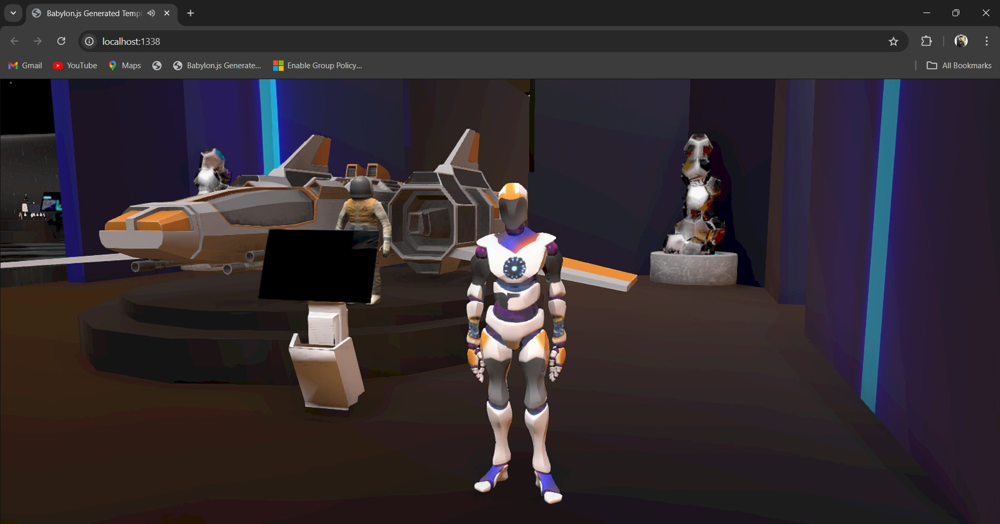
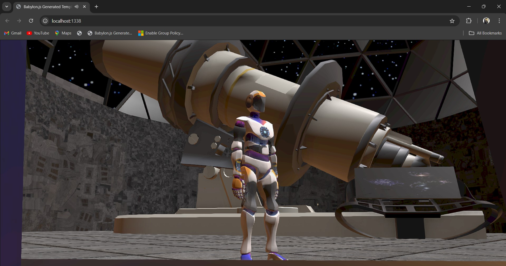
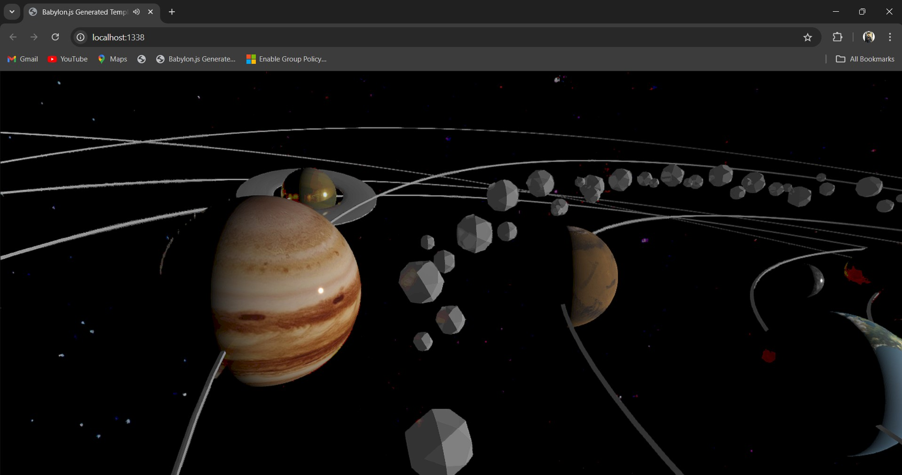
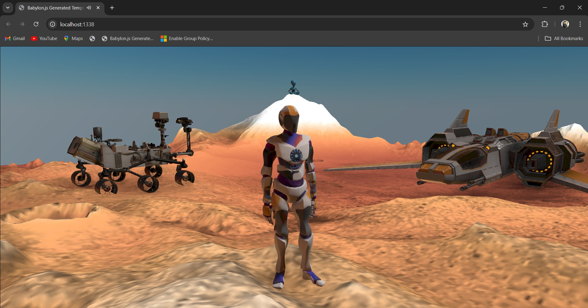
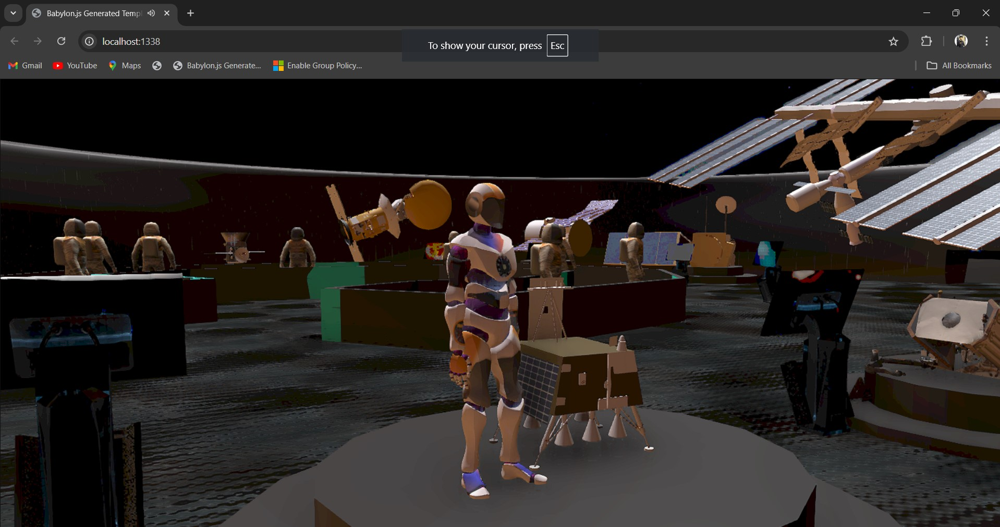
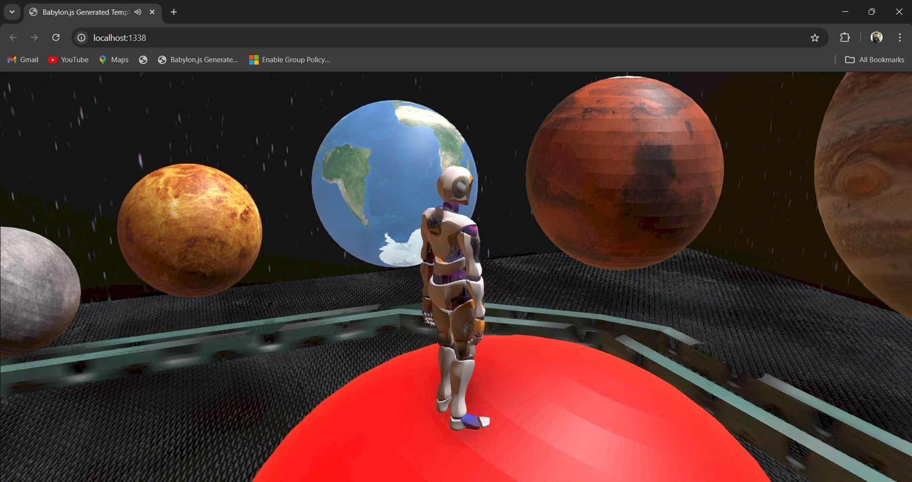
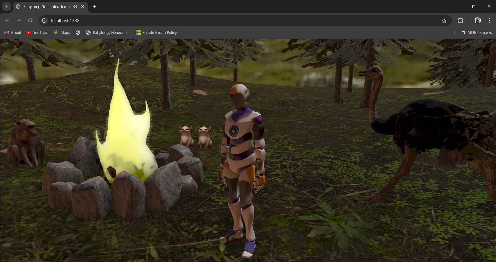
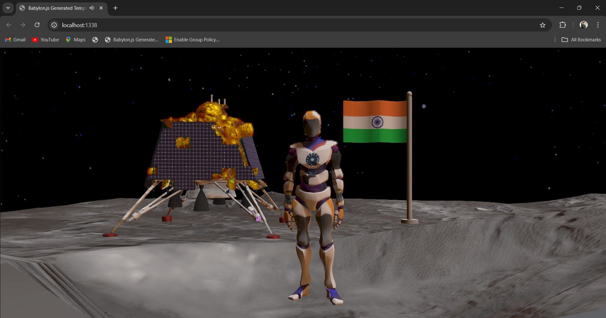
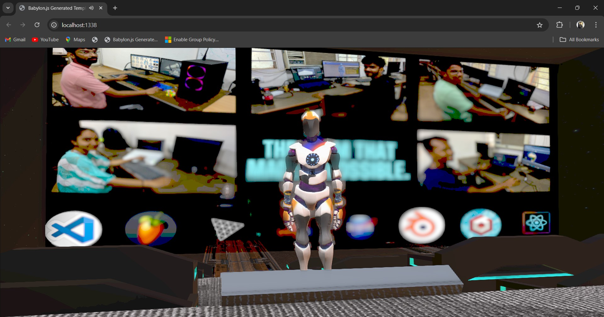
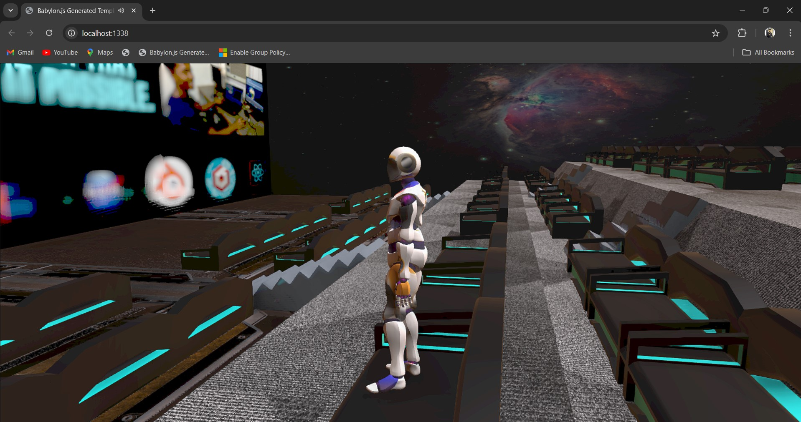

# Celestia

Welcome to the Space Explorer web application! This project aims to provide an interactive and educational experience for users interested in space exploration. The application consists of several key features:

1. **Homepage**: A landing page with an overview of the app and navigation to different sections.
2. **Educational Page**: A section dedicated to educational content.
3. **Educational Page**: A section dedicated to space-related news.
4. **Satellite Tracking Page**: Real-time tracking of the International Space Station (ISS) using its current location data.
5. **Visit Page**: A virtual planetarium where users can navigate and explore celestial bodies in 3D.

## Technologies Used

- **React Three Fiber**: Utilized for building the front end, providing a robust and efficient UI.
- **Babylon.js**: Used to create interactive 3D experiences, powering the virtual planetarium feature.
- **Tailwind CSS**: Employed for styling and design, ensuring a responsive and visually appealing user interface.

## Images

.png)
.png)
.png)

